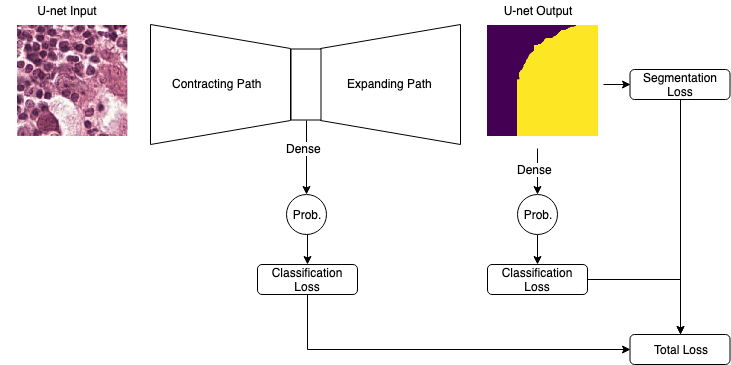
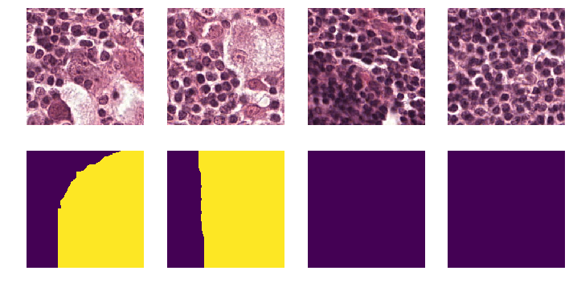

# Deep Learning for Metastatic Breast Cancer Detection

# Breast Cancer Image Classification
Dataset used in this project are whole-slide images (WSIs) of sentinel lymph node biopsy collected indepen-dently from Radbound University Medical Center, and the University Medical Center Utrecht.
This is available at: https://drive.google.com/drive/folders/0BzsdkU4jWx9Bb19WNndQTlUwb2M

## Folder Structure

## Baseline Algorithm
- Extract WSIs images at ×32 Magnification level
- Data pre-processing: remove background and potential annotations
- Resize images to (1024, 450) for improving training efficiency
- Three-layer CNN:


## Patch Framework
- Each original input WSIs was stored as a series of tiles
- Convert each tile into a patch
- Use converted image patches, size of (256, 256) for training
- option to fine-tune on the pretrained models with imagenet weights

### Resnet50
- From Keras.Applications and with our own modifications
- Binary classification for each patch
### VGG19
- From Keras.Applications and with our own modifications
- Binary classification for each patch
### Inception_V3
- From Keras.Applications and with our own modifications
- Binary classification for each patch
### U-Net 
- Our novel multi-tasking structure
- Semantic Segmentation
### Our architecture
- Based on U-net
- Multi-task training, segmentation task and classification task




## Run the Pipeline
Install dependencies.
```
pip install -r requirements.txt
```

### Data Preprocessing


#### Download Slide Images and Annotations
`cd` into `data_process`. Make sure `credential.json` exits in `data_process`. With the `--dry-run` flag,
the script will not download the slide images, but the annotations will still be downloaded.
```
python --train-folder TRAIN_FOLDER --test-folder TEST_FOLDER [--dry-run]
```

#### Produce Image Patches
The patching pipeline is implemented in this [Jupyter Notebook](notebooks/Patch_Sampling.py).



### Training
#### Download Training Set
`cd breast_cancer`

`mkdir data`

`mkdir data/input`

`mkdir data/log`

`mkdir data/model`

`aws s3 cp s3://cmu-10707-breast-cancer/dev data/input/dev`

#### Training
`screen -S training`

`source activate tensorflow_p36`

`export PYTHONPATH=.`

Sample training command.
```
python modeling/train.py --batch-size 1024 --epochs 100 --early-stop-patience 3 \
 --train-index-file-path data/input/dev/index_patch_train_split.csv --train-input-folder data/input/dev \
 --val-index-file-path data/input/dev/index_patch_val_split.csv --val-input-folder data/input/dev \
 --model-suffix first_run
```

`CTRL A+D` to detach from `screen`.
##### Tensorboard

`screen -S tensorboard`

`cd data/log`

`tensorboard --logdir .`

