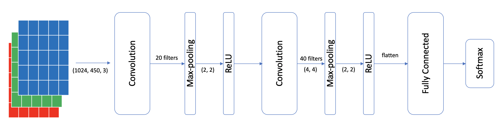
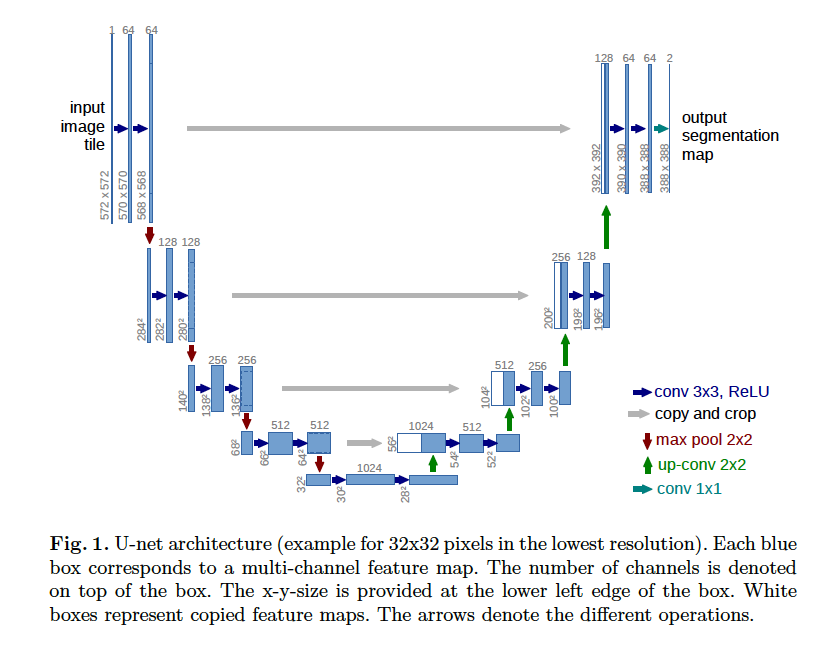

# Deep Learning for Metastatic Breast Cancer Detection

# Breast Cancer Image Classification
Dataset used in this project are whole-slide images (WSIs) of sentinel lymph node biopsy collected indepen-dently from Radbound University Medical Center, and the University Medical Center Utrecht.
This is available at: https://drive.google.com/drive/folders/0BzsdkU4jWx9Bb19WNndQTlUwb2M

## Folder Structure

## Baseline Algorithm
- Extract WSIs images at ×32 Magnification level
- Data pre-processing: remove background and potential annotations
- Resize images to (1024, 450) for improving training efficiency
- Three-layer CNN:



## Patch Framework
- Each original input WSIs was stored as a series of tiles
- Convert each tile into a patch
- Use converted image patches, size of (256, 256) for training
### U-Net
- CNN structure

### GoogLeNet


## Run the Pipeline
Install dependencies.
```
pip install -r requirements.txt
```

### Data Preprocessing

#### Download Slide Images and Annotations
`cd` into `data_process`. Make sure `credential.json` exits in `data_process`. With the `--dry-run` flag,
the script will not download the slide images, but the annotations will still be downloaded.
```
python --train-folder TRAIN_FOLDER --test-folder TEST_FOLDER [--dry-run]
```

## References

